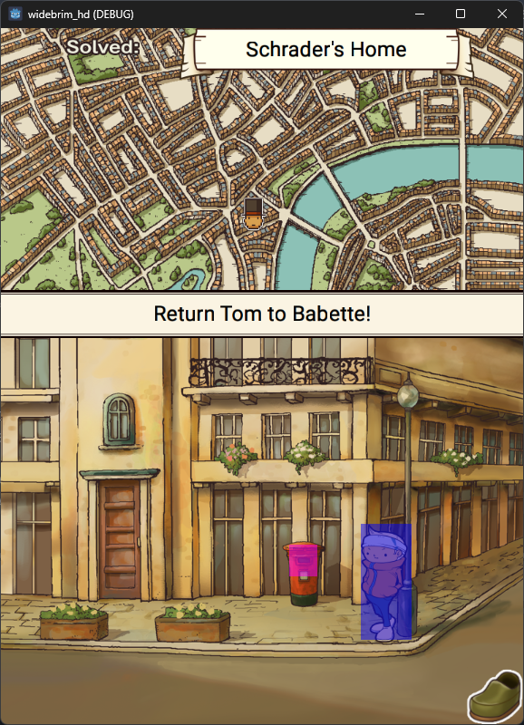
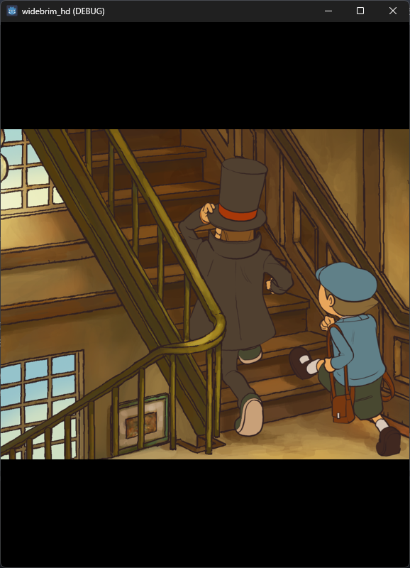
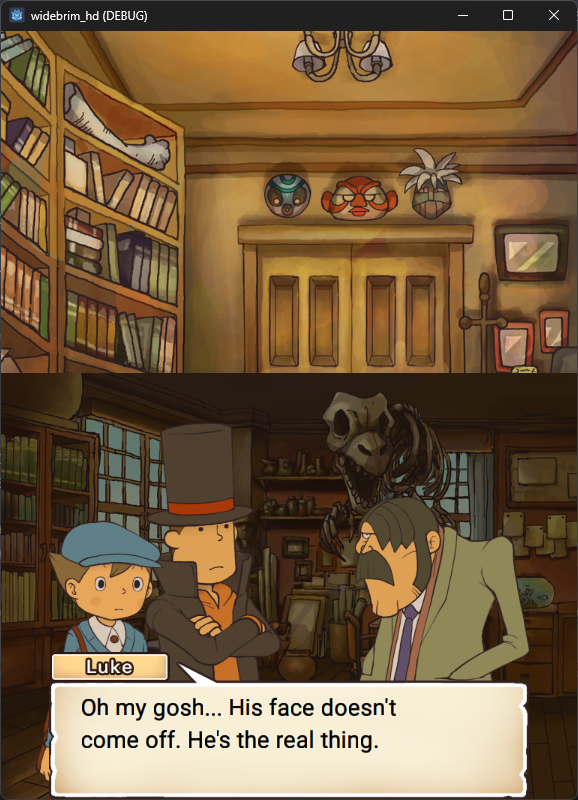

# widebrim HD

  
  
  
   <i>assets by Level-5, running in widebrim HD</i>

widebrim HD is a work-in-progress Godot-based high-level engine recreation for the mobile versions of LAYTON2 _(Layton: Diabolical Box in HD / Layton: Pandora's Box in HD)_ for running the game **natively, without emulation** on any compatible system.

## Quickstart: How do I get this running?
### Required Prerequisites
You will need the following:

 - A dump of LAYTON2 HD for Android
	 - For older versions, you will need the APK and OBB
	 - For newer versions, you will need unmodified base and InstallAssets APKs
	 - Global builds are preferable for wider language support
 - Godot 4.2 or newer
 - Python 3+
 - [PyCriCodecs](https://github.com/Youjose/PyCriCodecs), tested with 0.4.8

### Optional Prerequisites
To improve your experience, the following is recommended:

 - FFMPEG with libvorbis (i.e., any modern FFMPEG 'essentials' build)
	 - This can either be installed system-wide (i.e., on PATH for Windows) or [downloaded locally](https://www.ffmpeg.org/download.html) **(-f flag must be specified during install)**
	 - **Strongly recommended.** Without FFMPEG, audio is left uncompressed and consumes significant storage space.
- If installing from an OBB, an environment for building Python extensions (e.g., Microsoft Build Tools for Visual Studio)
	- **This is not needed for newer versions using the split APK** because encryption has been removed. The provided extension only accelerates OBB decryption.

### Installation Guide

For obvious reasons, widebrim HD is not bundled with any game assets. A Python script is provided to unpack game archives and convert relevant assets to native formats. Install by doing the following:

 1. Install the required prerequisites (and optional ones for a better experience).
 2. Clone the repository.
 3. Start a terminal inside `widebrim_hd/assets_py_unpacker` and run the following:
    - Install requirements with `pip install -r requirements.txt`
	     - <i>(Optional, <b>recommended if installing from an OBB</b>)</i> Build Cython extension for faster unpacking with `python setup.py build_ext --inplace`.
    - Unpack and convert assets with `python install_apk_obb.py <path to base apk> <path to additional data>`.
	    - The additional data can either be the OBB or InstallAssets APK. **New versions must use the InstallAssets APK for additional data and not be modified to merge the APKs.** Use the base APK that corresponds to the additional data. 
	    - The install script has arguments that can be set to change its behavior:
		    - `-f <path to ffmpeg executable>` to use a local build of FFMPEG if system build is not available.
		    - `--jp`, `--en_eu`, `--en_us`, `--es`, `--fr`, `--it`, `--de`, `--nl`, `--ko` to filter the installed languages to save space. Global builds have all languages except Japanese. Default behavior exports all languages; this will be overridden if any language flag is set. Multiple language flags can be set simultaneously. **This does not currently modify the Godot install** so make sure to set `CONFIG_GAME_LANGUAGE` in `widebrim_hd\godot\scripts\consts.gd`. **By default, English (Europe) is used**.
	    - To see all options, do `python install_apk_obb.py --help`
 4. Import `widebrim_hd/project.godot` into the Godot Editor. This will take a long time for first boot - even a single-language install has around 12,000 assets!

## Quickstart: How do I use this?

Open Godot, load the project and press Play in the top-right. By default, the game loads and saves a DS-like save slot as `state.sav` in the project root. To delete all progression and restart, delete this save.

**Exporting is experimental and will be that way until foundational asset loaders are complete.** It is expected that exporting will break between commits in this early stage of the project. **For now, play entirely in editor.**

## What is widebrim HD for?

widebrim HD continues where [widebrim](https://github.com/bullbin/widebrim) left off and tackles research for the HD ports of LAYTON2... ...but to be honest, it's actually just for fun, I don't know much about Godot 😄

## How accurate is this?
widebrim HD is a rewrite of [widebrim](https://github.com/bullbin/widebrim) combined with additional knowledge from reversing LAYTON2 HD. It tries to be largely accurate and should replicate most engine-related bugs in the future, especially because the new engine itself has none of the quirks of the Nintendo DS version.

## How far along is this?
Not very, gamemode switching is implemented and a basic event and room parser have been written. It's not known how far along the story can be completed yet.

## How can I contribute?
### Something broke and I'd like to file a bug report
**Please open a GitHub issue describing the problem, your save file and steps to reproduce.** The save system in-game isn't complete yet so we might need significant information if the bug isn't easily reproducible. Thanks!

### I'd like to request a feature
Open a GitHub issue - keep in mind that features in the original game are already intended to have implementations in widebrim HD.

### I'd like to contribute code
Feel free, open a pull request 😎

## Who's fault is this?
Thanks goes to...
 - The contributors of [PyCriCodecs](https://github.com/Youjose/PyCriCodecs), audio support is planned and this library is responsible for making it possible ❤️
 - ssh for figuring out the decryption routine for the HD Layton games (RIP ZenHAX)
 - [creativelynameduser](https://github.com/creativelynameduser) for their help with decoding the in-game font format
 - Everyone who helped with [widebrim](https://github.com/bullbin/widebrim) and by extension, [madhatter](https://github.com/bullbin/madhatter) for understanding HD file formats